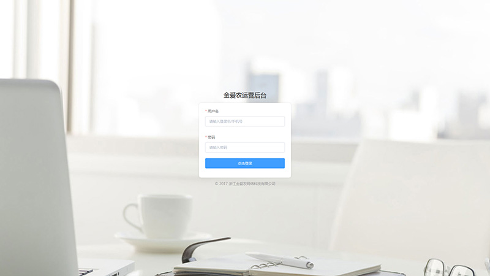
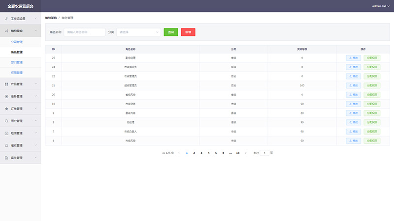
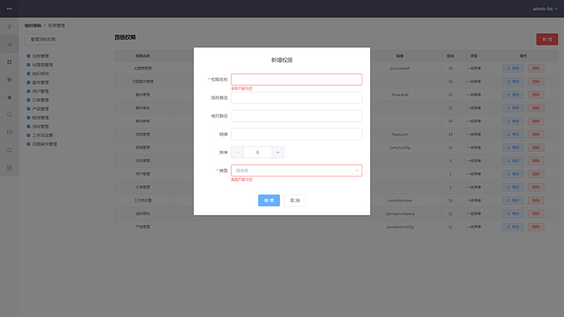
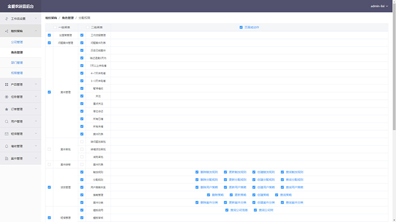

# vue-admin

整理的后台管理/配置界面，使用vue + router + element-ui + scss。

效果预览可以[点击这里](https://jingjingke.github.io/vue-admin/dist/)

项目文件基本都在src目录中，这个不用细说了。现在只做了前面的几块，工作之余会将页面陆续更新完（路由中定义的那些页面）。

## 其它话

这个界面不完全参照公司后台系统，不过我当时是用bootstrap配合VUE去做，组件基本也是自己封装，现在看上去页面已经有点旧了，有点不太顺眼。所以前段时间萌生了想法，想把UI界面换一换，然后就看上了element-ui。虽然element-ui做不到十全十美，但是里面很多封装好的组件感觉都非常好用的~

## 效果

